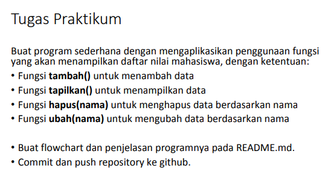

# pertemuan10
##Lab 6

* Pertama masukan syintax

      data = []
      data = {}

      def tambah():
          print("=======Tambah Data=======")
          nama    =input("Nama                :  ")
          nim     =input("Nim                 :  ")
          tugas   =int(input("Masukan Nilai Tugas :  "))
          uts     =int(input("Masukan Nilai UTS   :  "))
          uas     =int(input("Masukan Nilai UAS   :  "))
          akhir   = (0.30 * tugas) + (0.35 * uts) + (0.35 * uas)
          data[nama] = nim ,tugas, uts, uas, akhir

      def lihat():
          if data.items():
          print("=======Daftar Nilai Mahasiswa=======")
          print("================================================================================================")
          print(" |NO   |     NAMA      |    NIM    |     TUGAS    |     UTS     |       UAS    |    AKHIR     | ")
          print("================================================================================================")
          i=0
          for x in data.items():
             i+=1
             print(" | {6:2}  |  {0:12s} | {1:9s} | {2:11}  | {3:11} | {4:11}  |  {5:11} |".format(x[0], x[1][0], x[1][1], x[1][2], x[1][3], x[1][4], i))
             print("============================================================================================")
      else:
          print("=======Daftar Nilai Mahasiswa======")
          print("================================================================================================")
          print(" |NO   |     NAMA      |    NIM    |     TUGAS    |     UTS     |       UAS    |    AKHIR     | ")
          print("================================================================================================")
          print("|                                      TIDAK ADA DATA                                         |")
          print("===============================================================================================")

      def ubah():
          print('=======Ubah Data Mahasiswa=======')
          nama = input('Nama                :  ')
          if nama in data.keys():
              nim     =input('Nim                 :  ')
              tugas   =int(input("Masukan Nilai Tugas :  "))
              uts     =int(input("Masukan Nilai UTS   :  "))
              uas     =int(input("Masukan Nilai UAS   :  "))
              akhir   =(0.30 * tugas) + (0.35 * uts) + (0.35 * uas)
              data[nama] = nim, tugas, uts, uas, akhir
        else:
              print("Data Nilai Tidak Ada".format(nama))

      def hapus():
          print("=======Hapus Data Mahasiswa=======")
          nama=input("Nama :  ")
          if nama in data.keys():
              del data[nama]
        else:
            print("Data Nilai Tidak Ada".format(nama))

* Tetapi syintax ini jangan di Run terlebih dahulu karena akan eror jika Run,untuk itu kita buat file kedua disini saya menamakan lab6,kemudian tambahkan syintax berikut :

      from data import data

      print("PROGRAM MENAMPILKAN DAFATR NILAI MAHASISWA")
      while True:
         print("")
         c =input("(L)lihat, (T)ambah, (U)bah, (H)apus, (K)eluar : ")
         if c.lower() == 't':
            print("=======Tambah Data=======")
            nama = input("Nama                :  ")
            nim = input("Nim                 :  ")
            tugas = int(input("Masukan Nilai Tugas :  "))
            uts = int(input("Masukan Nilai UTS   :  "))
            uas = int(input("Masukan Nilai UAS   :  "))
            akhir = (0.30 * tugas) + (0.35 * uts) + (0.35 * uas)
            data[nama] = nim, tugas, uts, uas, akhir
      elif c.lower() == 'u':
        print('=======Ubah Data Mahasiswa=======')
        nama = input('Nama                :  ')
        if nama in data.keys():
            nim = input('Nim                 :  ')
            tugas = int(input("Masukan Nilai Tugas :  "))
            uts = int(input("Masukan Nilai UTS   :  "))
            uas = int(input("Masukan Nilai UAS   :  "))
            akhir = (0.30 * tugas) + (0.35 * uts) + (0.35 * uas)
            data[nama] = nim, tugas, uts, uas, akhir
        else:
            print("Data Nilai Tidak Ada".format(nama))
      elif c.lower() == 'l':
        print("=======Daftar Nilai Mahasiswa=======")
        print("================================================================================================")
        print(" |NO   |     NAMA      |    NIM    |     TUGAS    |     UTS     |       UAS    |    AKHIR     | ")
        print("================================================================================================")
        i = 0
        for x in data.items():
            i += 1
            print(
                " | {6:2}  |  {0:12s} | {1:9s} | {2:11}  | {3:11} | {4:11}  |  {5:11} |".format(x[0], x[1][0], x[1][1],
                                                                                                x[1][2], x[1][3],
                                                                                                x[1][4], i))
            print("============================================================================================")
            
      elif c.lower() == 'h':
          print("=======Hapus Data Mahasiswa=======")
          nama = input("Nama :  ")
          if nama in data.keys():
              del data[nama]
          else:
              print("Data Nilai Tidak Ada".format(nama))

      elif c.lower() == 'k':
          print("Keluar")
          break
          
   *  Dan ini hasil Run nya :
   
   
   
   ### Sekian dan terimakasih